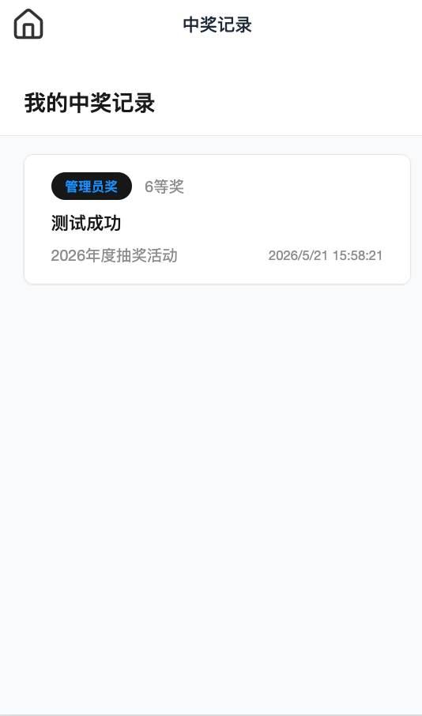

# Coze Mini Program

一个可运行的企业抽奖小程序示例，基于 `Taro 4 + React + NestJS`，支持 H5、本地微信小程序和后端 API 服务。

## 项目亮点

- 前端使用 `Taro 4` + `React 18`，兼容 H5、微信小程序和头条小程序
- 样式统一使用 `Tailwind CSS 4`，并配合 `weapp-tailwindcss` 做跨端适配
- UI 组件集中管理在 `src/components/ui`，页面优先复用组件库
- 后端使用 `NestJS` + `Supabase/Drizzle ORM` 实现活动、奖品、抽奖逻辑
- 网络请求统一封装在 `src/network.ts`，避免直接调用 `Taro.request`
- 支持管理员奖项管理、用户登录、抽奖、历史记录查询

## 功能概览

- 登录页：输入姓名和工号，模拟管理员/领导/员工身份
- 抽奖页：显示当前活动、奖品列表、抽奖结果
- 管理页：管理员新增/删除奖品、管理活动内容
- 历史页：查看抽奖记录与中奖结果
- 后端 API：`/api/auth`、`/api/events`、`/api/prizes`、`/api/lottery`

## 技术栈

- 框架：Taro 4.1.9
- 语言：TypeScript 5.4.5
- React：18.0.0
- 样式：Tailwind CSS 4.1.18
- 小程序适配：weapp-tailwindcss 4.9.2
- 状态管理：Zustand 5.0.9
- 图标：lucide-react-taro
- 构建工具：Vite 4.2.0
- 后端：NestJS 10.4.15
- ORM：Drizzle ORM 0.45.1
- 校验：Zod 4.3.5
- 包管理：pnpm 9+

## 仓库结构

```text
├── .cozeproj/                 # Coze 平台配置
├── config/                    # Taro 构建配置
├── dist/                      # 微信小程序构建产物
├── dist-web/                  # H5 构建产物
├── dist-tt/                   # 头条小程序构建产物
├── server/                    # NestJS 后端服务
│   └── src/
├── src/                       # 前端源码
│   ├── app.ts                 # 应用根组件
│   ├── app.config.ts          # 应用配置
│   ├── app.css                # 全局样式
│   ├── network.ts             # 网络请求封装
│   ├── components/ui/         # UI 组件库
│   ├── pages/                 # 页面实现
│   ├── presets/               # 框架级预置逻辑
│   └── utils/                 # 通用工具函数
├── types/                     # 类型声明
├── key/                       # 小程序密钥（CI 上传用）
├── package.json              # 工程配置与脚本
└── project.config.json       # 微信小程序项目配置
```

## 主要页面

- `src/pages/index/index.tsx`：登录页面
- `src/pages/lottery/index.tsx`：抽奖页面
- `src/pages/admin/index.tsx`：管理员奖项管理
- `src/pages/history/index.tsx`：抽奖历史记录

## 项目截图

> 以下是建议使用的截图布局。请将实际截图文件放入 `docs/screenshots/`，并替换下面的示例路径。

### 登录页


### 抽奖页


### 管理页


### 历史页



如果你已经有截图文件，可以直接把它们放入 `docs/screenshots/`，并将路径替换成本地图片文件名。

## 主要后端模块

- `server/src/modules/auth`：登录与用户查询
- `server/src/modules/event`：活动列表和活跃活动
- `server/src/modules/prize`：奖品管理接口
- `server/src/modules/lottery`：抽奖规则与中奖记录

## 快速开始

### 安装依赖

```bash
pnpm install
```

### 本地开发

```bash
pnpm dev
```

> 同时启动 H5 前端和 NestJS 后端

默认地址：

- H5：`http://localhost:5000`
- 后端：`http://localhost:3000`

### 单独运行

```bash
pnpm dev:web      # 仅 H5 前端
pnpm dev:weapp    # 仅微信小程序
pnpm dev:server   # 仅后端服务
```

### 构建发布

```bash
pnpm build
pnpm build:web
pnpm build:weapp
pnpm build:server
```

### 小程序预览

```bash
pnpm preview:weapp
```

## 本地开发建议

- 所有网络请求必须使用 `Network` 统一封装，避免直接调用 `Taro.request` / `Taro.uploadFile` / `Taro.downloadFile`
- UI 组件优先复用 `src/components/ui/*` 中已有组件
- 样式优先使用 Tailwind 类，不要大量使用内联 `style`
- 小程序端特殊组件需平台检测，例如相机、视频、Canvas 等
- `pnpm validate` 执行 ESLint 和 `tsc` 检查代码质量

## 代码约定

- 文件名：`kebab-case`
- 组件/类型：`PascalCase`
- 变量和函数：`camelCase`
- 常量：`UPPER_SNAKE_CASE`
- 路径别名：`@/*` 指向 `src/*`

## 网络请求规范

`src/network.ts` 封装了统一请求入口：

- `Network.request()`
- `Network.uploadFile()`
- `Network.downloadFile()`

它会自动添加项目域名前缀，适配不同环境。

## GitHub 展示建议

- 上传此仓库到 GitHub
- 在仓库首页展示本 `README.md` 和项目截图
- 若需要展示 H5 入口，可补充 `Demo` 说明：`pnpm dev:web`
- 若需要展示小程序体验，可补充 `Preview` 说明：`pnpm preview:weapp`

## 额外说明

- 后端入口文件：`server/src/main.ts`
- NestJS 已通过全局前缀 `/api` 暴露接口
- `key/` 目录保存小程序密钥，仅用于 CI 上传，不要提交真实机密

## 可扩展方向

如果你希望继续构建，这个项目可以进一步扩展为：

1. 活动管理控制台（创建、启用、关闭活动）
2. 角色权限体系（管理员 / 领导 / 员工）
3. 抽奖概率配置与奖品库存管理
4. 报表展示与抽奖记录导出
